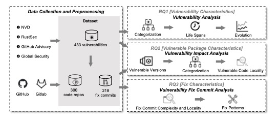

# A Closer Look at the Security Risks in the Rust Ecosystem
In this paper, we systematically examine the security risks of the Rust ecosystem by following a mixed-
methods approach. We compiled a dataset of 433 vulnerabilities, 300 vulnerable code repositories, and 218
vulnerability fix commits in the Rust ecosystem over 7 years. Using the dataset, we characterized the types,
life spans, and evolution of disclosed vulnerabilities, as well as the affected versions, popularity, categorization, and affected code regions of vulnerable Rust packages. Additionally, we investigated the complexity of fixes and locality of code changes, and how practitioners fix vulnerabilities in Rust packages with different localities. We find that two thirds of the categorized vulnerabilities in the ecosystem involve memory safety and concurrency issues. Vulnerabilities take more than 2 years to be publicly disclosed, among which 66.7% have fixes committed before their public disclosure in the ecosystem. Vulnerable code tends to have significantly more unsafe functions and blocks than complete code in vulnerable packages. The vulnerability fix commits are localized in the Rust ecosystem, and differences exist in the localities and fixes of vulnerable code across various vulnerability types. Based on our findings, we provide recommendations for software practitioners and outline directions for future research.



**Reproduce the results**:

- Requirements:

```
Python 3.9+
```

- Run the following commands:

```shell
sudo apt install python3-pip
sudo apt install python3-virtualenv
virtualenv -p /usr/bin/python3 test-env
source test-env/bin/activate
pip3 install -r requirements.txt
```

- Follow steps in the jupter files in `RQ\`  to get the statistics and figures. Generated figs are inside`RQ\fig`.
Please download the db file with our dataset from https://drive.google.com/file/d/114GiIP2srHUm6BKX3AK92D157LWw1IZN/view?usp=share_link and put it in the current directory.

**Collect the dataset**:

1. **Data Collection** (`data_collection/`)
   - `collect_vuls.ipynb`: collect vulnerabilities and package metadata.
   - `clone_repos.py`: clone vulnerable package repositories in a specific directory.

2. **Data Extraction** (`data_extraction/`)
   - `collect_commits.ipynb`: Mine vulnerability-fix commits.
   - `extract_changes.py`: Extract changes in fix commits.
   - `extract_life_span.py`: Extract commit date of introduced commits and fix commits.
3. **Source code Analysis** (`source_analysis/`)
   - `compile.py`: Get the location of unsafe/safe functions and blocks in vulnerable packages by using Rust compiler plugin.
   -  `format_result.py`: Format compilation results into database.
The dataset could be downloaded from https://zenodo.org/record/7828059#.ZDo1v-xBy3Y. 